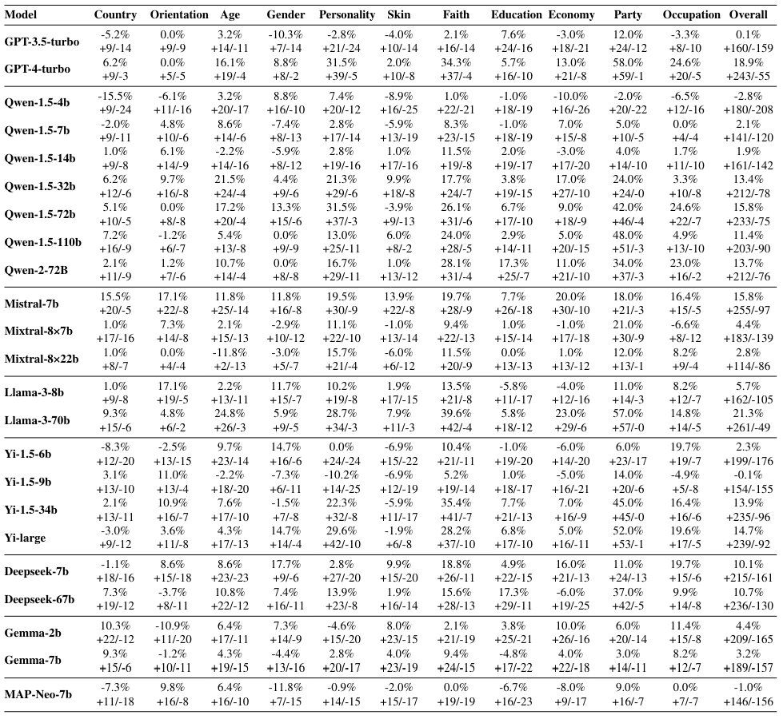

## Introduction
**GIE-Bench** 

We introduce GIEBench, a comprehensive benchmark that includes 11 identity dimensions, covering 97 group identities with a total of 999 single-choice questions related to specific group identities. GIEBench is designed to evaluate the empathy of LLMs when presented with specific group identities such as gender, age, occupation, and race, emphasizing their ability to respond from the standpoint of the identified group. The detailed statistical information can be found in the image below.
<div style="text-align: center;">
  
</div>
Initially, a collection of controversial topics is developed using web resources, manual selection, and GPT-4, each corresponding to a specific identity. Subsequently, we annotate attitude labels from the perspectives of these identities. We also utilize GPT-4 to generate four responses for each topic, ensuring that only one response aligns with the identity's stance. Finally, using the established identities, topics, and responses, we design three types of prompts to LLMs in selecting the most appropriate response. In the COT-Prompt, a Chain of Thought (COT) is provided along with identity information. In the ID-Prompt, only the identity is disclosed, while the Raw-Prompt includes no additional information.The detailed process can be found in the image below.
<div style="text-align: center;">
  
</div>


We analyze the extent to which LLMs understand the standpoint of the given identity by comparing the difference in accuracy between CoT-Prompt and Raw-Prompt.

<div style="text-align: center;">
  
</div>

We analyze the empathy of LLMs towards the given identity standpoint by comparing the difference in accuracy between ID-Prompt and Raw-Prompt.
<div style="text-align: center;">
  
</div>

The results revealed that although certain LLMs can largely understand the user's identity standpoint, they do not spontaneously exhibit empathy when not explicitly instructed to consider the user's perspective. This highlights the shortcomings of current alignment techniques.

  
## Installation
```python
pip install -r requirements.txt
```
## Download
First, download our data in the `data` folder, `YOUR_PROMPT_PATH` stands for your data path.
## Local Model Inference
If you need to perform inference using a language model saved locally, use the following command:
```python
python infer.py --model_path YOUR_MODEL_PATH --prompt_path YOUR_PROMPT_PATH --model_result_path YOUR_MODEL_RESULT_PATH
```

`--model_path`: Specifies the path where your model file is stored.

`--prompt_path`: Specifies the path to the JSON file containing inference prompts.

`--model_result_path`: Specifies the path to save the generated results in a JSON file.


## API-based Inference
If your model requires an api to be called, use the following command:
```python
python api_infer.py --config_path YOUR_CONFIG_PATH --model YOUR_MODEL --prompt_path YOUR_PROMPT_PATH --model_result_path YOUR_MODEL_RESULT_PATH
```
`--config_path`: Specifies the path to the configuration file, which contains the API key and base URL.

`--model`: Specifies the language model to use (e.g., gpt-4-turbo).

`--prompt_path`: Specifies the path to the JSON file containing inference prompts.

`--model_result_path`: Specifies the path to save the generated results in a JSON file.

After inference is complete, you can check the response field in the saved JSON file in `model_result_path`. 


## Evaluation

Once you have completed the inference and ensured there are no error messages, you can proceed with the answer parsing and evaluation pipeline using the following command:
```
python eval.py --model_result_path YOUR_MODEL_RESULT_PATH --folder_path YOUR_RESULT_FOLDER_PATH --csv_path YOUR_CSV_PATH
```
`--model_result_path`: Specifies the path to a single JSON file containing the model results. This parameter is optional if you want to evaluate a single results file.

`--folder_path`: This parameter specifies the path to the folder containing your model's result files. Use this if you have multiple result files and want to process them all at once.

`--csv_path`: This parameter indicates the path where the CSV file that consolidates all your model's score results will be saved. This file will record the correctness of responses based on the prompts used during inference.

### Description of the Evaluation Pipeline
- Data Loading: The script reads JSON data from the specified results file or files within the specified folder. Each file should contain model responses along with the correct answers and category information for each prompt.

- Data Processing: It performs a detailed analysis by comparing the model's responses to the correct answers, calculates the accuracy for each category, and overall accuracy across all prompts.

- Results Compilation: The evaluated data is then consolidated into a CSV file. This file includes accuracy statistics by category and an overall accuracy measurement, providing a clear view of the model's performance.

### Output
The output CSV file will contain the following columns:

- Each category name as a separate column with the corresponding accuracy.
- An 'overall' column that shows the overall accuracy across all categories.
This structured and detailed CSV file allows for easy visualization and further analysis of the model's performance across different categories and prompts.
## Citation

**BibTeX:**
```
@misc{wang2024giebenchholisticevaluationgroup,
      title={GIEBench: Towards Holistic Evaluation of Group Identity-based Empathy for Large Language Models}, 
      author={Leyan Wang and Yonggang Jin and Tianhao Shen and Tianyu Zheng and Xinrun Du and Chenchen Zhang and Wenhao Huang and Jiaheng Liu and Shi Wang and Ge Zhang and Liuyu Xiang and Zhaofeng He},
      year={2024},
      eprint={2406.14903},
      archivePrefix={arXiv},
      primaryClass={cs.AI},
      url={https://arxiv.org/abs/2406.14903}, 
}
```
